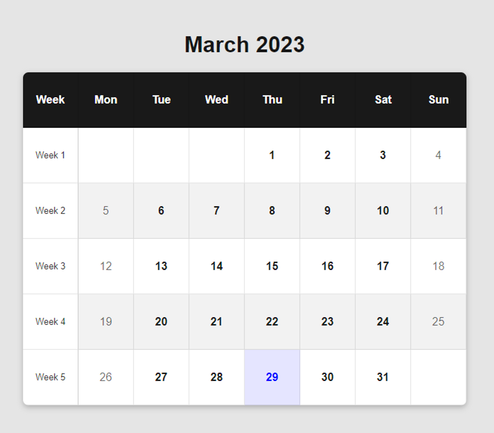

In the following exercise, you will be required to create a calendar that automatically calculates the current month and day and displays all dates in a grid format.

 

Note that you will need to organise days in a <html> table by their corresponding day of the week and the week in that month. You are supplied with both an index.html and styles.css file and are not allowed to change these.

 

You are also supplied with a scripts.js file. Note that you are only allowed to change the code between the two comments. In other words, you will primarily update the following functions:

createData
createCell
createHtml

At the moment the code is broken. However, apply everything you’ve learned thus far about JavaScript to have the table render the current month you are in (dynamically) as in the example below (however note that you are most likely in a different month and not March 2023).

 

Note that you should also highlight the current day in blue.

Summary:

HTML and CSS are provided. Don’t change these
Use the provided CSS classes to style the created elements
The current month and year should be displayed above the calendar
Each week must be indicated in the left most column (Always starts with Week 1, Week 2 etc.)
Weeks should alternate between white and grey
Each date of the month should be displayed under the corresponding weekday
The current day should be highlighted in blue

 

 

In this challenge you have to create a calendar, now this might sound daunting and a bit scary but believe it or not, you will be able to successfully complete this challenge if you have watched all the lecture videos, worked through the resources given and last but not least here are a few more resources to guide you in the right direction. Use your knowledge of arrays, loops, ternary operators, methods, and objects to complete this challenge.

 

MDN documentation on topics such as Date, Arrays, and Template literals to understand the correct usage and syntax for the functions and operations used in the code:
